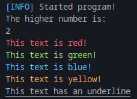

# MYSTDLIB
- A simple remake of the standard library provided by python.
- Made for learning purposes, not meant to replace anything.
- In VERY early development, and only contains barebones right now.
- Updates every day?
- Instructions below

# Windows
- Must have the following: python, visual studio code.
- Open a visual studio code terminal and run the following command: (python test.py)
- This will run the test.py file provided by me, however you can make your own files/edit the code.

# Linux
- Must have the following: python3, visual studio code.
- Open a visual studio code terminal and run the following command: (python3 test.py)
- This will run the test.py file provided by me, however you can make your own files/edit the code.

# Tutorial
- I reccomend you use the test.py file provided in the main directory of the project to write your code using this library.
- When you run the code already in it, you should see this in the console:

