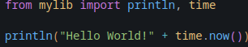

# MYSTDLIB - A simple stdlib remake
- This is a simple stdlib remake in python
- This is not better then the std in anyway, it's just for learning purposes
- This is also In early development.
- See instructions for running below.

#1 Windows
- First fork the project Into (Visual Studio Code).
- Make sure you have python installed
- Add some code to test.py
- To run it, open the vscode terminal (ctrl + shift + ~), then type (python test.py)

#2 Linux
- First fork the project Into (Visual Studio Code).
- Make sure you have python installed
- Add some code to test.py
- To run it, open the vscode terminal (ctrl + shift + ~), then type (python3 test.py)

# Examples

